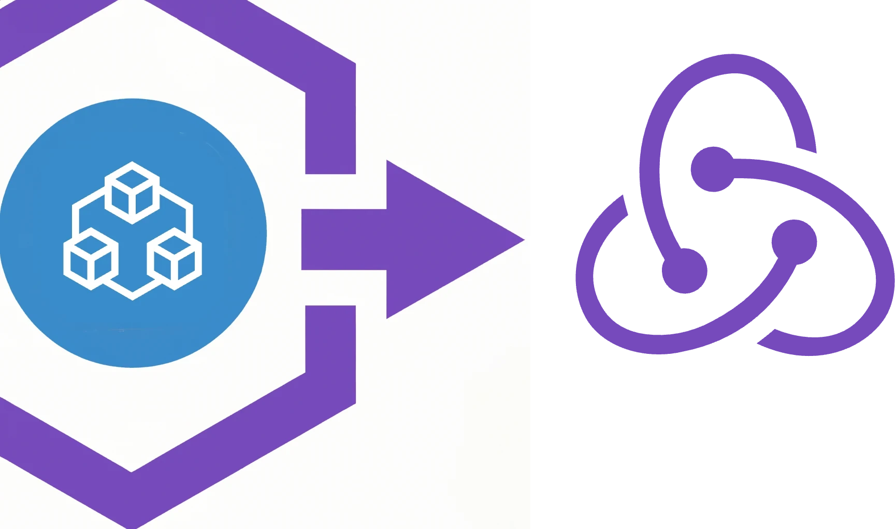

<div align="center">
  <h1>trpc-rtk-query</h1>
  <a href="https://www.npmjs.com/package/trpc-rtk-query"></a>
  <a href="./LICENSE"></a>
  <br />
  <p><strong>Automatically generate RTK Query API endpoints from your tRPC setup</strong></p>
</div>

---

## Why use trpc-rtk-query?

**trpc-rtk-query** bridges the gap between [tRPC](https://trpc.io/) and [RTK Query](https://redux-toolkit.js.org/rtk-query/overview), giving you the best of both worlds:

- **🔒 End-to-end type safety** - Leverage tRPC's type inference with RTK Query's powerful data fetching
- **⚡ Incremental adoption** - Gradually migrate from tRPC to RTK Query without breaking existing code
- **🎣 Familiar React hooks** - Use RTK Query's battle-tested hooks (`useQuery`, `useMutation`) with full TypeScript support
- **📦 Redux integration** - Access Redux DevTools, normalized caching, and the entire Redux ecosystem
- **🔄 Automatic synchronization** - Keep your UI in sync with server state using RTK Query's built-in cache management
- **🛠️ Zero boilerplate** - No manual endpoint definitions needed - everything is generated from your tRPC router types

### Perfect for teams who want to:

- Add Redux and RTK Query to an existing tRPC application
- Use RTK Query's advanced features (optimistic updates, cache invalidation, polling) with tRPC procedures
- Maintain type safety while integrating with Redux-based state management
- Leverage existing tRPC backend infrastructure with React applications using Redux

---

## Installation

### Prerequisites

- Node.js >= 20
- TypeScript >= 5.0
- Existing tRPC v10 setup (v11 support coming soon)
- React application (for React hooks)

### Install dependencies

```bash
# npm
npm install trpc-rtk-query @reduxjs/toolkit @trpc/client @trpc/server

# yarn
yarn add trpc-rtk-query @reduxjs/toolkit @trpc/client @trpc/server

# pnpm
pnpm add trpc-rtk-query @reduxjs/toolkit @trpc/client @trpc/server
```

**Minimum version requirements:**

- `@trpc/client` >= 10.45.2
- `@trpc/server` >= 10.45.2
- `@reduxjs/toolkit` >= 2.2.1

---

## Getting Started

### Step 1: Set up your tRPC router

If you already have a tRPC router, you can skip this step. Otherwise, create a basic router:

```typescript
/* server.ts */
import { initTRPC } from "@trpc/server";
import { z } from "zod";

const t = initTRPC.create();
export const publicProcedure = t.procedure;

export const appRouter = t.router({
  userList: publicProcedure
    .input(z.object({ showAll: z.boolean() }))
    .query(async ({ input }) => {
      // Your database query here
      return await db.user.findMany({
        where: input.showAll ? {} : { active: true },
      });
    }),
  userCreate: publicProcedure
    .input(z.object({ name: z.string(), email: z.string().email() }))
    .mutation(async ({ input }) => {
      return await db.user.create({ data: input });
    }),
});

export type AppRouter = typeof appRouter;
```

### Step 2: Create a tRPC client

Set up your tRPC client [as normal](https://trpc.io/docs/client/vanilla):

```typescript
/* client.ts */
import { createTRPCProxyClient, httpBatchLink } from "@trpc/client";
import type { AppRouter } from "./server";

export const client = createTRPCProxyClient<AppRouter>({
  links: [
    httpBatchLink({
      url: "http://localhost:3000/trpc",
      // Optional: add headers for authentication
      async headers() {
        return {
          authorization: getAuthToken(),
        };
      },
    }),
  ],
});
```

### Step 3: Create your trpc-rtk-query API

Choose one of two approaches:

#### Option A: Enhance an existing RTK Query API

```typescript
/* api.ts */
import { createApi, fetchBaseQuery } from "@reduxjs/toolkit/query/react";
import { enhanceApi } from "trpc-rtk-query";
import { client } from "./client";

// Your existing RTK Query API
const rtkApi = createApi({
  baseQuery: fetchBaseQuery({ baseUrl: "/" }),
  tagTypes: ["User", "Post"],
  endpoints: () => ({}),
});

// Enhance it with tRPC endpoints
export const api = enhanceApi({
  client, // Your typed tRPC client
  api: rtkApi, // Your existing RTK Query API
  // Optional: configure individual endpoints
  endpointOptions: {
    userList: {
      providesTags: ["User"],
    },
    userCreate: {
      invalidatesTags: ["User"],
    },
  },
});

// Export your fully-typed hooks
export const { useUserListQuery, useUserCreateMutation } = api;
```

#### Option B: Start with an empty API

```typescript
/* api.ts */
import { createEmptyApi, enhanceApi } from "trpc-rtk-query";
import { client } from "./client";

export const api = enhanceApi({
  client,
  api: createEmptyApi(), // Helper that creates a base API with no endpoints
  endpointOptions: {
    userList: {
      providesTags: ["User"],
    },
  },
});

export const { useUserListQuery, useUserCreateMutation } = api;
```

### Step 4: Configure your Redux store

Add the API to your Redux store [like any RTK Query API](https://redux-toolkit.js.org/rtk-query/overview):

```typescript
/* store.ts */
import { configureStore } from "@reduxjs/toolkit";
import { api } from "./api";

export const store = configureStore({
  reducer: {
    [api.reducerPath]: api.reducer,
  },
  middleware: (getDefaultMiddleware) =>
    getDefaultMiddleware().concat(api.middleware),
});

export type RootState = ReturnType<typeof store.getState>;
export type AppDispatch = typeof store.dispatch;
```

### Step 5: Use type-safe hooks in your components

```typescript
/* App.tsx */
import { useUserListQuery, useUserCreateMutation } from "./api";

export const UserList = () => {
  const { data, isLoading, error } = useUserListQuery({ showAll: true });
  const [createUser] = useUserCreateMutation();

  if (isLoading) return <p>Loading...</p>;
  if (error) return <p>Error loading users</p>;

  return (
    <div>
      <h1>Users</h1>
      <ul>
        {data?.map((user) => (
          <li key={user.id}>{user.name}</li>
        ))}
      </ul>
      <button
        onClick={() =>
          createUser({ name: "John Doe", email: "john@example.com" })
        }
      >
        Add User
      </button>
    </div>
  );
};
```

---

## Common Use Cases

### Nested routers

tRPC routers can be nested. trpc-rtk-query automatically flattens them with underscore separation:

```typescript
const appRouter = t.router({
  user: t.router({
    list: publicProcedure.query(() => []),
    detail: t.router({
      byId: publicProcedure.input(z.number()).query(() => ({})),
    }),
  }),
});

// Generated hooks:
const { useUser_listQuery } = api; // user.list
const { useUser_detail_byIdQuery } = api; // user.detail.byId
```

### Dynamic client with Redux state

If you need to access Redux state when creating your tRPC client (e.g., for authentication):

```typescript
export const api = enhanceApi({
  api: createEmptyApi(),
  getClient: async (baseQueryApi) => {
    // Access Redux state
    const state = baseQueryApi.getState() as RootState;
    const token = state.auth.token;

    return createTRPCProxyClient<AppRouter>({
      links: [
        httpBatchLink({
          url: "http://localhost:3000/trpc",
          headers: {
            authorization: `Bearer ${token}`,
          },
        }),
      ],
    });
  },
});
```

### Optimistic updates

Use RTK Query's `onQueryStarted` for optimistic updates:

```typescript
export const api = enhanceApi({
  client,
  api: createEmptyApi(),
  endpointOptions: {
    userCreate: {
      async onQueryStarted(newUser, { dispatch, queryFulfilled }) {
        // Optimistically update the cache
        const patchResult = dispatch(
          api.util.updateQueryData("userList", { showAll: true }, (draft) => {
            draft.push({ ...newUser, id: "temp-id" });
          }),
        );

        try {
          await queryFulfilled;
        } catch {
          // Revert on failure
          patchResult.undo();
        }
      },
      invalidatesTags: ["User"],
    },
  },
});
```

### Polling and refetching

Use RTK Query's built-in polling:

```typescript
const { data } = useUserListQuery(
  { showAll: true },
  {
    pollingInterval: 5000, // Poll every 5 seconds
    refetchOnMountOrArgChange: true,
  },
);
```

---

## API Reference

### `enhanceApi<TRouter, ExistingApi>(options)`

Enhances an existing RTK Query API with tRPC-generated endpoints.

**Parameters:**

- `options.api` - An existing RTK Query API created with `createApi()` or `createEmptyApi()`
- `options.client` - A tRPC proxy client created with `createTRPCProxyClient<AppRouter>()`
- `options.getClient` (alternative to `client`) - A function that returns a tRPC client, with access to Redux state via `BaseQueryApi`
- `options.endpointOptions` (optional) - Per-endpoint configuration for RTK Query options like `providesTags`, `invalidatesTags`, `onQueryStarted`, etc.

**Returns:** Enhanced API with generated hooks for all tRPC procedures

**Type Parameters:**

- `TRouter` - Your tRPC router type (inferred from client)
- `ExistingApi` - The type of your existing RTK Query API

**Example:**

```typescript
const api = enhanceApi({
  api: myExistingApi,
  client: trpcClient,
  endpointOptions: {
    myProcedure: {
      providesTags: ["MyTag"],
    },
  },
});
```

### `createEmptyApi()`

Helper function that creates a base RTK Query API with no endpoints. Useful when you don't have an existing RTK Query API and want to start fresh.

**Returns:** An empty RTK Query API ready to be enhanced with `enhanceApi()`

**Example:**

```typescript
const api = enhanceApi({
  api: createEmptyApi(),
  client: trpcClient,
});
```

---

## Migration Guide

### Migrating from pure tRPC to trpc-rtk-query

If you're currently using tRPC with vanilla React hooks and want to add RTK Query:

**Before:**

```typescript
import { trpc } from "./trpc";

function UserList() {
  const users = trpc.userList.useQuery({ showAll: true });
  // ...
}
```

**After:**

```typescript
import { useUserListQuery } from "./api";

function UserList() {
  const users = useUserListQuery({ showAll: true });
  // Same interface, but now with RTK Query features!
}
```

**Migration checklist:**

1. Install `trpc-rtk-query` and `@reduxjs/toolkit`
2. Create your enhanced API using `enhanceApi()`
3. Set up Redux store with the API reducer and middleware
4. Replace tRPC hook calls with the generated RTK Query hooks
5. Update component imports
6. Optionally add RTK Query features (tags, optimistic updates, polling)

---

## TypeScript Configuration

For the best type inference, ensure your `tsconfig.json` has strict mode enabled:

```json
{
  "compilerOptions": {
    "strict": true,
    "strictNullChecks": true,
    "esModuleInterop": true,
    "skipLibCheck": true,
    "moduleResolution": "bundler",
    "module": "ESNext",
    "target": "ES2022"
  }
}
```

---

## Troubleshooting

### "Type instantiation is excessively deep and possibly infinite"

**Problem:** TypeScript may complain about deep type instantiation with large or deeply nested routers.

**Solutions:**

- Break down large routers into smaller, more focused routers
- Use type assertions for very complex endpoint options
- Ensure you're using TypeScript 5.0 or higher

### Generated hooks are not type-safe

**Problem:** Hooks don't show proper types or autocomplete.

**Solutions:**

- Verify your tRPC client is properly typed with `createTRPCProxyClient<AppRouter>()`
- Make sure you're exporting the router type: `export type AppRouter = typeof appRouter`
- Check that your `tsconfig.json` has `strict: true`
- Restart your TypeScript server in your IDE

### Endpoint names are unexpected

**Problem:** Generated hook names don't match what you expect.

**Explanation:** Nested router procedures are flattened with underscore separation. For example:

- `api.user.list` becomes `useUser_listQuery`
- `api.posts.comments.create` becomes `usePosts_comments_createMutation`

**Solution:** Rename your tRPC procedures if needed, or use the generated names.

### Mutations don't invalidate cache

**Problem:** After a mutation, queries don't automatically refetch.

**Solution:** Configure `providesTags` and `invalidatesTags`:

```typescript
endpointOptions: {
  userList: {
    providesTags: ['User'],
  },
  userCreate: {
    invalidatesTags: ['User'],
  },
}
```

### "Client is not defined" error

**Problem:** The tRPC client is not being created correctly.

**Solutions:**

- If using `client` option, ensure it's created before passing to `enhanceApi()`
- If using `getClient` option, make sure it returns a Promise that resolves to a valid client
- Verify your tRPC links are configured correctly

### ESLint errors with TypeScript config

**Problem:** ESLint doesn't recognize the TypeScript configuration file.

**Solution:** Install `jiti` for TypeScript config support:

```bash
pnpm add -D jiti
```

---

## Development Status

This library is currently in **alpha stage** (0.x.x versions). While functional and used in production by some teams, it's not yet considered production-ready for all use cases.

See the [project status](https://github.com/users/otahontas/projects/2) for current development progress and planned features before the 1.0.0 release.

**Known limitations:**

- Only tRPC v10 is supported (v11 support planned)
- Some advanced TypeScript edge cases may not work perfectly
- Limited examples and real-world usage documentation

---

## Contributing

Contributions are welcome! Please feel free to submit issues, feature requests, or pull requests.

---

## License

MIT © Otto Ahoniemi
